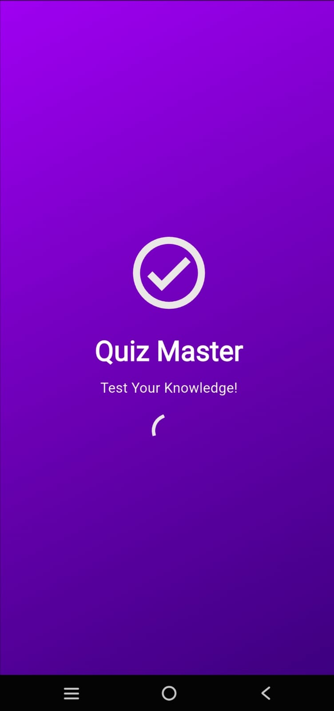
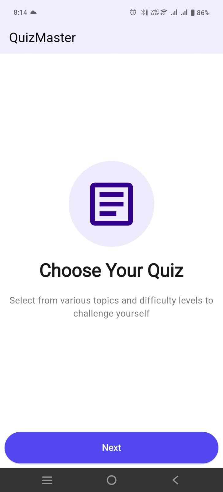
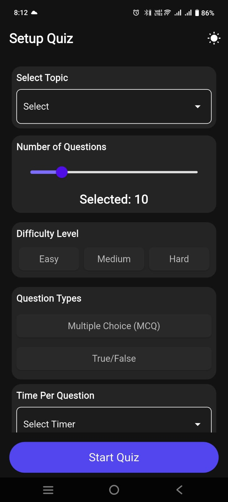
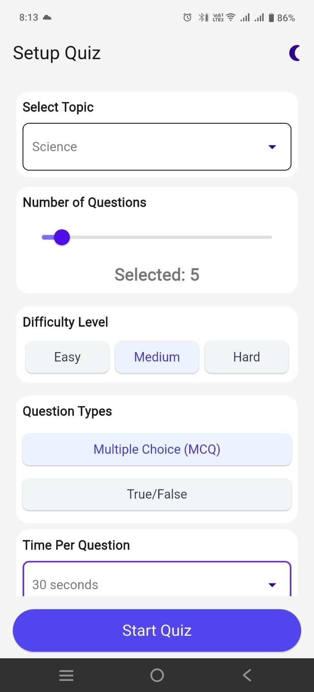
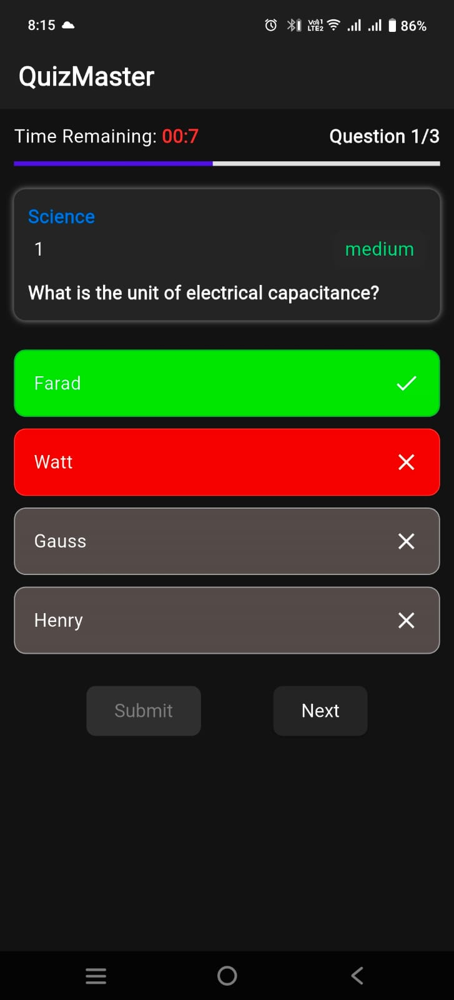
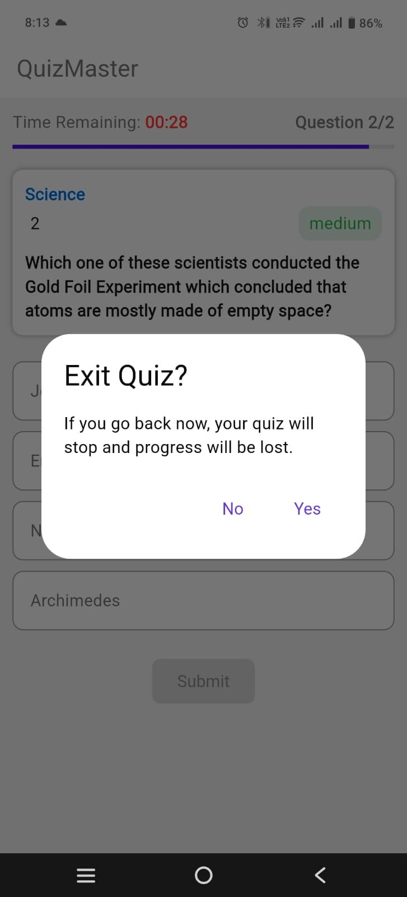
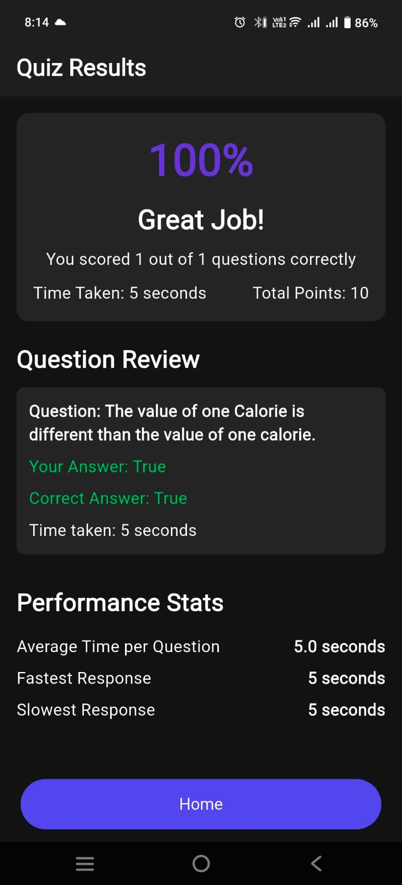
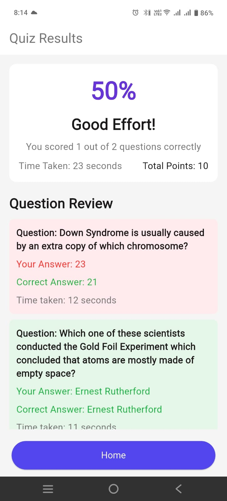

# QuizMasterApp
This Flutter-based mobile application enables users to participate in quizzes across various categories. The app evaluates responses in real time and generates results, offering an engaging and interactive learning experience.

# 🧠 QuizMaster — Flutter Quiz App

> 🚀 A beautiful, reactive quiz app built with Flutter + MobX. Configure quizzes, race against time, and review detailed results — all with smooth animations and dark/light theme support.


---

## 🌟 Features

✅ **Dynamic Theming** — Toggle between light/dark mode instantly  
✅ **Quiz Configuration** — Choose category, difficulty, timer, # of questions  
✅ **Auto-Submit Timer** — Questions auto-submit if time runs out  
✅ **Animated UI** — Smooth entrance animations, progress bars, feedback  
✅ **Detailed Results** — Score, time stats, question-by-question review  
✅ **Responsive Design** — Works on all screen sizes (phones, tablets)  
✅ **Accessibility Ready** — Semantic labels, scalable text  
✅ **Edge-to-Edge UI** — Immersive full-screen experience  
✅ **Error Handling** — Graceful API/network failure handling  
✅ **No Boilerplate Navigation** — Clean, linear flow with `pushReplacement`

---

## 🖼️ Screenshots
<div align="center">

### 📸 App Screenshots

| Splash Screen             | Start Page (Light)         | Start Page (Dark)          |
|---------------------------|----------------------------|----------------------------|
|  |  |  |

| Quiz Page (Light)         | Quiz Page (Dark)           | Exit Quiz Dialog           |
|---------------------------|----------------------------|----------------------------|
|  |  |  |

| Result Screen (Dark)      | Result Screen (Light)      |                            |
|---------------------------|----------------------------|----------------------------|
|  |  | |

</div>


## 🛠️ Tech Stack

| Category       | Technology                          |
|----------------|-------------------------------------|
| **Framework**  | Flutter (Dart)                      |
| **State Mgmt** | MobX + get_it (Reactive, no boilerplate) |
| **Navigation** | `pushReplacement` (Linear flow)     |
| **API**        | OpenTriviaDB (Free quiz API)        |
| **Styling**    | Custom themes, `AppSizes.dp/sp()` for responsiveness |
| **Architecture** | Clean, modular, observer pattern  |
| **Tools**      | VS Code, Flutter DevTools |

---

## 📲 How to Run

### Prerequisites
- Flutter SDK (3.10+)
- Dart (3.0+)
- Android Studio / VS Code

### Steps
```bash
# Clone repo
git clone https://github.com/Shailendra122/QuizMasterApp.git

# Get dependencies
flutter pub get

# Run on device/emulator
flutter run